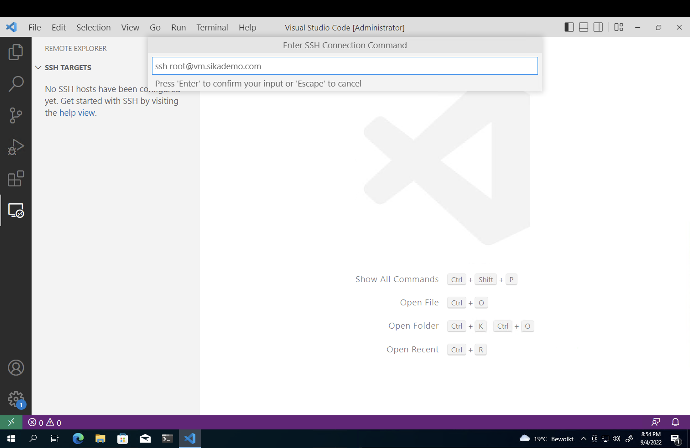
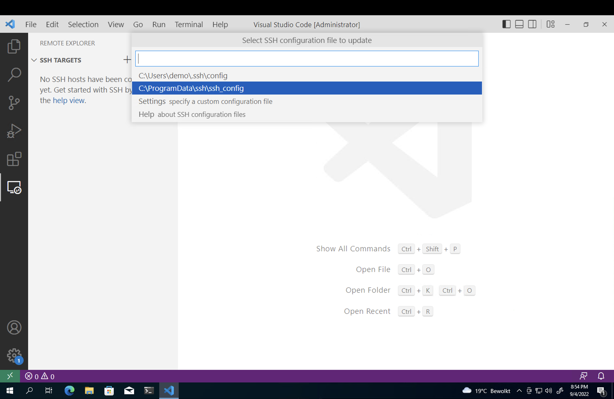
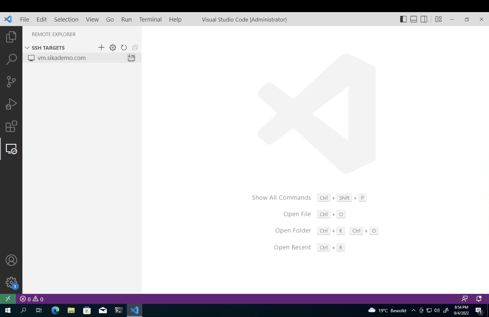
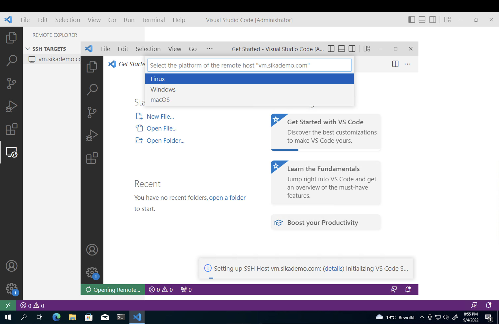
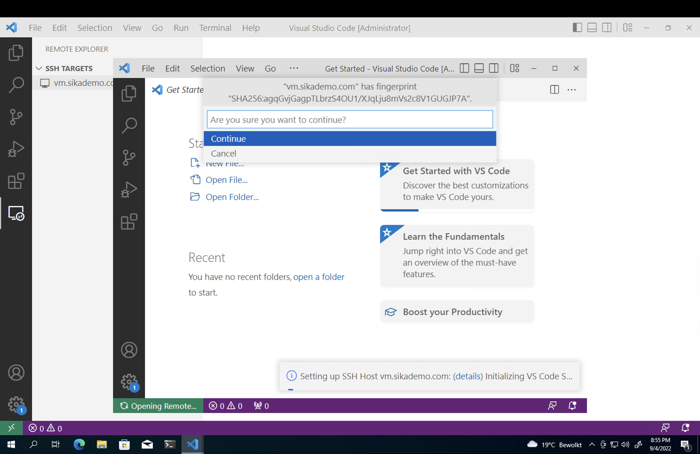
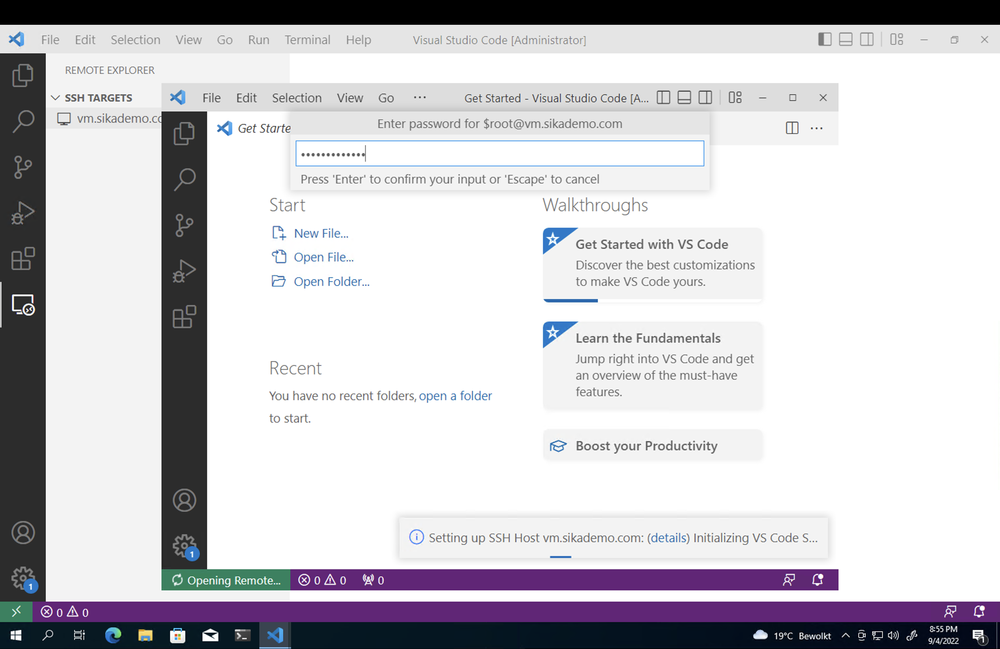
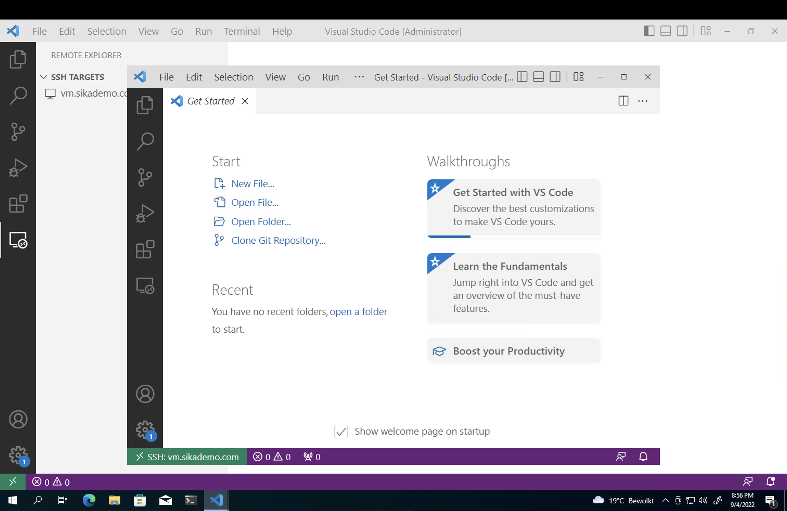
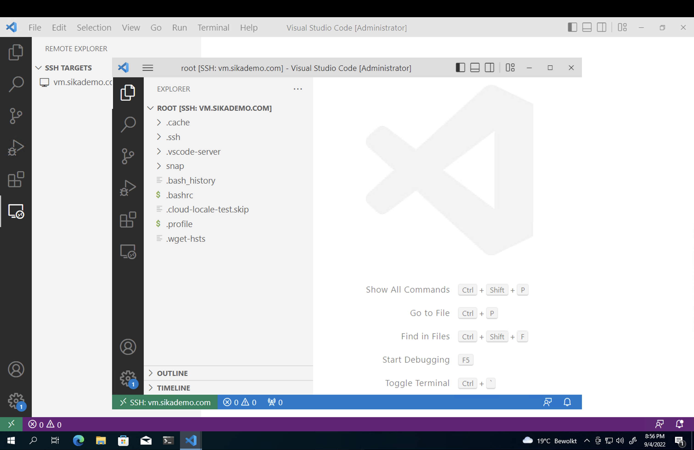
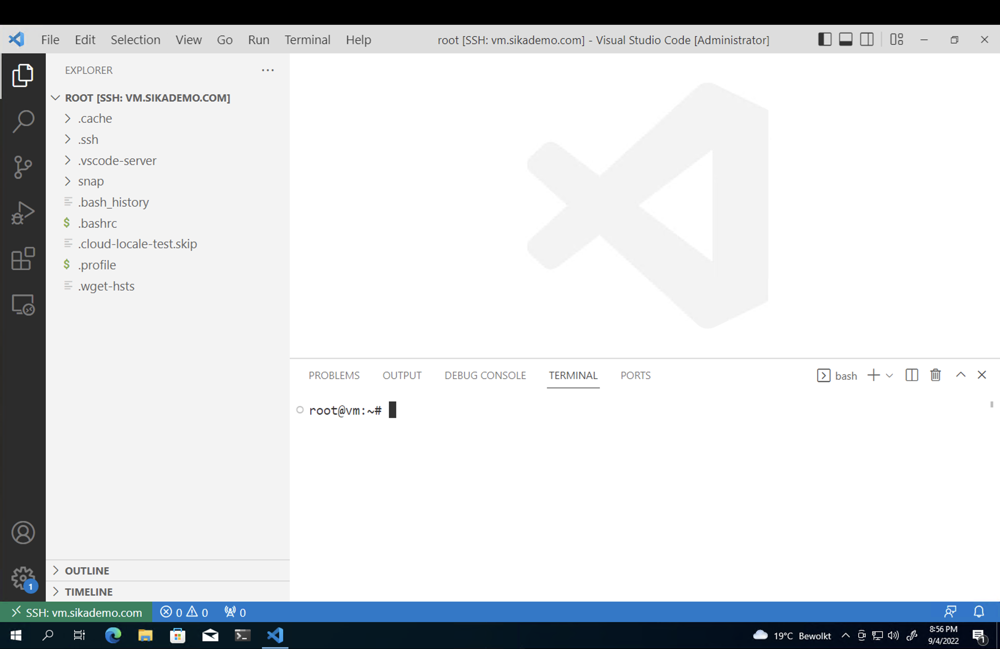

<!-- BEGIN header -->

[Ondrej Sika (sika.io)](https://sika.io) | <ondrej@sika.io> | [**Meta Skoleni**](https://ondrej-sika.cz/skoleni/meta/) 🚀💻

<!-- END header -->

# Meta Training

## Windows Terminal

- https://github.com/microsoft/terminal
- https://apps.microsoft.com/store/detail/windows-terminal/9N0DX20HK701

## WSL

- https://docs.microsoft.com/en-us/windows/wsl/
- https://docs.microsoft.com/en-us/windows/wsl/install
- https://docs.microsoft.com/en-us/windows/wsl/install-manual

## Install WSL

Install WSL

```
wsl --install
```

**Reboot**

Install Debian into WSL

```
wsl --install -d debian
```

Complete installation in separed window.

Run WSL Debian

```
wsl
```

or open Debian in own tab in Windows Terminal

## Package Managers

## Chocolatey

- https://chocolatey.org/
- https://chocolatey.org/install#individual

## Install Chocolatey

```
Set-ExecutionPolicy Bypass -Scope Process -Force; [System.Net.ServicePointManager]::SecurityProtocol = [System.Net.ServicePointManager]::SecurityProtocol -bor 3072; iex ((New-Object System.Net.WebClient).DownloadString('https://community.chocolatey.org/install.ps1'))
```

## Scoop

- https://scoop.sh/
- https://github.com/ScoopInstaller/Install#readme

## Install Scoop

As regual user (not administrator powershell)

```
Set-ExecutionPolicy RemoteSigned -Scope CurrentUser
irm get.scoop.sh | iex
```

As administrator

```
Set-ExecutionPolicy RemoteSigned -Scope CurrentUser
iex "& {$(irm get.scoop.sh)} -RunAsAdmin"
```

## Winget

- https://docs.microsoft.com/en-us/windows/package-manager/
- https://docs.microsoft.com/en-us/windows/package-manager/winget/
- https://apps.microsoft.com/store/detail/app-installer/9NBLGGH4NNS1

## Brew / Homebrew

Package manager on Mac

- https://brew.sh/

### Install Brew

```
/bin/bash -c "$(curl -fsSL https://raw.githubusercontent.com/Homebrew/install/HEAD/install.sh)"
```

## Slu - SikaLabs Utils

- https://github.com/siklabs/slu

## Visual Studio Code

- https://code.visualstudio.com/
- https://vscode.dev/
- https://apps.microsoft.com/store/detail/visual-studio-code/XP9KHM4BK9FZ7Q

## Install VS Code

Windows Store

- https://apps.microsoft.com/store/detail/visual-studio-code/XP9KHM4BK9FZ7Q

Windows Winget

- https://winget.run/pkg/Microsoft/VisualStudioCode

```
winget install -e --id Microsoft.VisualStudioCode
```

Windows Chocolatey

```
choco install vscode
```

Brew

```
brew install --cask visual-studio-code
```

## VS Code Configuration

Open configuation by `cmd` + `shift` + `p` or `ctrl` + `shift` + `p` and use **Preferences: Open User Setting (JSON)**.

You can also open the settings using `cmd` + `p` or `ctrl` + `p` (standart file search without `shift`) and use **> Preferences: Open User Setting (JSON)** (with a `>` as the first character in search bar).

### Sidebar Position Right

```json
{
  "workbench.sideBar.location": "right"
}
```

### Sticky Scroll

```json
{
  "editor.stickyScroll.enabled": true
}
```

## VS Code Keyboard Shortcuts (Cheet sheet)

- https://code.visualstudio.com/docs/getstarted/keybindings

Keyboard Shortcuts Reference

- Mac - https://code.visualstudio.com/shortcuts/keyboard-shortcuts-macos.pdf
- Windows - https://code.visualstudio.com/shortcuts/keyboard-shortcuts-windows.pdf
- Linux - https://code.visualstudio.com/shortcuts/keyboard-shortcuts-linux.pdf

## VS Code Plugins

General

- EditorConfig - https://marketplace.visualstudio.com/items?itemName=EditorConfig.EditorConfig
- Git Graph - https://marketplace.visualstudio.com/items?itemName=mhutchie.git-graph
- Remote - SSH - https://marketplace.visualstudio.com/items?itemName=ms-vscode-remote.remote-ssh
- GitHub Copilot - https://marketplace.visualstudio.com/items?itemName=GitHub.copilot

Specific

- GitLab Workflow / Gitlab CI - https://marketplace.visualstudio.com/items?itemName=GitLab.gitlab-workflow
- Docker - https://marketplace.visualstudio.com/items?itemName=ms-azuretools.vscode-docker
- Kubernetes - https://marketplace.visualstudio.com/items?itemName=ms-kubernetes-tools.vscode-kubernetes-tools
- Terraform - https://marketplace.visualstudio.com/items?itemName=HashiCorp.terraform
- Infracost - https://marketplace.visualstudio.com/items?itemName=Infracost.infracost
- Go - https://marketplace.visualstudio.com/items?itemName=golang.Go
- Prettier - https://marketplace.visualstudio.com/items?itemName=esbenp.prettier-vscode

## VS Code Remote SSH



















## SSH

### What is SSH

SSH (Secure Shell) is a protocol for securely connecting to remote machines over a network. It encrypts all traffic including passwords.

### Connect to Remote Server

```
ssh <user>@<hostname>
```

Example:

```
ssh root@vm.sikademo.com
```

Connect to a specific port:

```
ssh -p 2222 root@vm.sikademo.com
```

### SSH Agent

The SSH agent holds your decrypted private keys in memory so you don't have to enter the passphrase every time.

Start the agent:

```
eval $(ssh-agent)
```

Add your keys:

```
ssh-add
```

Or specific key

```
ssh-add ~/.ssh/sikademo_id_ed25519
```

List loaded keys:

```
ssh-add -l
```

### Generate SSH Key

Generate a new ED25519 key (recommended):

```
ssh-keygen -t ed25519 -C "root@vm.sikademo.com"
```

Generate RSA key (wider compatibility):

```
ssh-keygen -t rsa -b 4096 -C "root@vm.sikademo.com"
```

Keys are stored in `~/.ssh/`:

- `~/.ssh/id_ed25519` - private key (keep secret!)
- `~/.ssh/id_ed25519.pub` - public key (share this)

### Authorized Keys

The file `~/.ssh/authorized_keys` on the server contains public keys allowed to log in. Each line is one public key.

```
cat ~/.ssh/authorized_keys
```

### Copy Public Key to Server

```
ssh-copy-id root@vm.sikademo.com
```

Or manually append your public key to `~/.ssh/authorized_keys` on the server.

### SSH Config File

The SSH config file is at `~/.ssh/config`. It lets you define aliases and options for hosts so you don't have to type them every time.

Basic config:

```
Host vm
  HostName vm.sikademo.com
  User root
  Port 22
```

See example: [examples/sshconfig/sshconfig_basic](examples/sshconfig/sshconfig_basic)

Then connect with just:

```
ssh vm
```

#### Include Other Config Files

You can split your SSH config into multiple files using `Include`:

```
Include ~/.ssh/sshconfigs/foo/*.conf
Include ~/.ssh/sshconfigs/bar/*.conf
```

Put this at the top of `~/.ssh/config`, then keep per-project or per-environment configs in separate files:

```
~/.ssh/config  # main config with Include
~/.ssh/sshconfigs/foo/sshconfig.conf
~/.ssh/sshconfigs/bar/sshconfig.conf
```

> **Note:** `Include` paths are always resolved relative to `~/.ssh/`, regardless of where the config file is. When using `-F` with a config outside `~/.ssh/`, use an absolute path:
>
> ```
> Include /path/to/sshconfigs/*.conf
> ```

See example: [examples/sshconfig/includes](examples/sshconfig/includes)

Try it:

```
ssh -F examples/sshconfig/includes/config bar-vm2
```

#### Specify Custom Config File

Use `-F` to specify a different config file:

```
ssh -F ~/.ssh/config_work root@vm.sikademo.com
```

Disable config file entirely:

```
ssh -F /dev/null root@vm.sikademo.com
```

#### Disable Host Key Checking for Specific Hosts

Useful for ephemeral or demo servers where the host key changes often:

```
Host *.sikademo.com demo-* *-demo
  StrictHostKeyChecking no
  UserKnownHostsFile=/dev/null
```

`StrictHostKeyChecking no` skips the host key verification prompt. `UserKnownHostsFile=/dev/null` prevents saving the key to `~/.ssh/known_hosts`. The `Host` pattern supports multiple patterns and wildcards on one line.

See example: [examples/sshconfig/no_strict_host_checking](examples/sshconfig/no_strict_host_checking)

#### Specify Identity File

```
Host vm
  HostName vm.sikademo.com
  User root
  IdentityFile ~/.ssh/id_ed25519
```

See example: [examples/sshconfig/sshconfig_with_identity](examples/sshconfig/sshconfig_with_identity)

#### Jump Host (Bastion)

Connect to an internal server through a bastion/jump host:

```
Host bastion
  HostName jump.sikademo.com
  User root
  IdentityFile ~/.ssh/id_ed25519

Host internal
  HostName 10.0.0.10
  User root
  IdentityFile ~/.ssh/id_ed25519
  ProxyJump jump
```

See example: [examples/sshconfig/sshconfig_jump_host](examples/sshconfig/sshconfig_jump_host)

Then connect to the internal server directly:

```
ssh internal
```

#### SSH Tunnel (Local Port Forwarding)

Forward a local port to a remote service:

```
ssh -L 8000:localhost:80 root@vm.sikademo.com
```

This makes `localhost:8000` on your machine connect to port `80` on the remote server.

#### SSH Tunnel (Remote Port Forwarding)

Expose a local port on the remote server:

```
ssh -R 8000:localhost:80 root@vm.sikademo.com
```

This makes `vm.sikademo.com:8000` connect to port `80` on your local machine.

### Useful SSH Options

| Option              | Description                                 |
| ------------------- | ------------------------------------------- |
| `-v`                | Verbose output (debug connection issues)    |
| `-A`                | Forward SSH agent to remote (use with care) |
| `-N`                | No remote command (useful for tunnels only) |
| `-f`                | Run in background                           |
| `-L port:host:port` | Local port forwarding                       |
| `-R port:host:port` | Remote port forwarding                      |

### SCP - Copy Files over SSH

Copy a file to remote:

```
scp file.txt root@vm.sikademo.com:/root/
```

Copy a directory:

```
scp -r ./mydir root@vm.sikademo.com:/root/
```

Copy from remote:

```
scp root@vm.sikademo.com:/root/file.txt .
```

## Git

## Git Rebase Interactive

```
git rebase -i HEAD~10
```

## Slu for Git

### `slu git url open`

Try:

```
slu git url open
```

Alias

```
alias guo="slu git url open"

guo
```

### `slu git use-ssh`

Try:

```
git clone https://github.com/sikalabs/hello-world-server.git
cd hello-world-server
git remote -v
slu git use-ssh
git remote -v
```

## Bash

## Bash Shortcuts

- `ctrl` + `a` - move to start of the line
- `ctrl` + `e` - move to end of the line
- `ctrl` + `w` - delete one word
- `ctrl` + `l` - clear output
- `ctrl` + `d` - send eof, exit shell
- `ctrl` + `d` - send sig term
- `ctrl` + `\` - send sig kill

## Vim

## Vim Cheat Sheets

- https://devhints.io/vim
- https://vim.rtorr.com/

## Bash Utils

### ts (in moreutils)

Install

```
apt install moreutils
```

```
brew install moreutils
```

Example usage

```
slu scripts counter
```

```
slu scripts counter | ts
```

```
slu scripts counter | ts -s
```

### `tree`

```
tree
```

Show hidden files using `-a`

```
tree -a
```

Specify max depth by `-L <depth>`

```
tree -a -L 2
```

### Watch

```bash
watch date
```

```bash
watch -n 0.5 date
```

```bash
alias w="watch -n 0.3"

w date
```

### Slu Watch

```bash
slu watch -- date
```

```bash
slu watch -s 100 -- date
```

```bash
slu w -- date
```

## Dotfiles

- https://github.com/ondrejsika/dotfiles

## PowerShell Profiles (.bashrc in PowerShell)

- https://superuser.com/a/1090171
- https://devblogs.microsoft.com/scripting/understanding-the-six-powershell-profiles/

```
vim $profile
```

```
vim C:\Users\demo\Documents\WindowsPowerShell\Microsoft.PowerShell_profile.ps
```

## Go CLI

Example: <https://github.com/ondrejsikax/2026-05-31-o2-cli>

## Make

Simple example

```
cd ./examples/make/simple
```

```
make
```

```
make build
```

```
make push
```

```
make echo
```

```
make shell
```

Variables example

```
cd ./examples/make/variables
```

```
make
```

```
make HELLO=Ahoj
```

```
make say
```

```
MSG=Ahoj make say
```

```
make say MSG=Hello
```

```
MSG=Ahoj make say MSG=Hello
```

DRY (don't repeat yourself) example

```
cd ./examples/make/dry
```

```
make
```

```
make build-push PROJECT=foo
```

<!-- BEGIN footer -->

## Thank you! & Questions?

That's it. Do you have any questions? **Let's go for a beer!**

### Ondrej Sika

- email: <ondrej@sika.io>
- web: <https://sika.io>
- twitter: [@ondrejsika](https://twitter.com/ondrejsika)
- linkedin: [/in/ondrejsika/](https://linkedin.com/in/ondrejsika/)
- Newsletter, Slack, Facebook & Linkedin Groups: <https://join.sika.io>

_Do you like the course? Write me recommendation on Twitter (with handle `@ondrejsika`) and LinkedIn (add me [/in/ondrejsika](https://www.linkedin.com/in/ondrejsika/) and I'll send you request for recommendation). **Thanks**._

Wanna to go for a beer or do some work together? Just [book me](https://book-me.sika.io) :)

<!-- END footer -->
